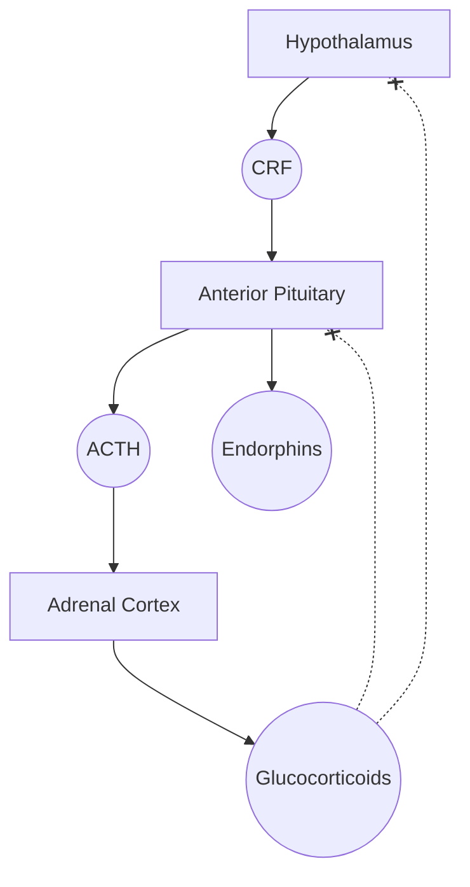

#hormone #peptide #hypothalamus #HPA


- Part of [[HPA Axis]]
- Acts on [[Anterior Pituitary]] to release [[Adrenocorticotropic Releasing Hormone (ACTH)|Adrenocorticotropin Releasing Hormone (ACTH)]] and [[Endorphins]]
- Inhibited by [[glucocorticoids]]

```mermaid
graph TD
```