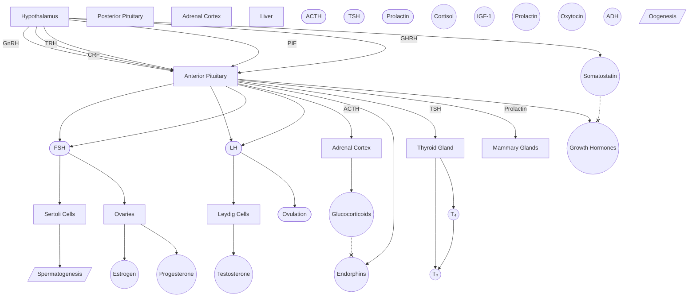
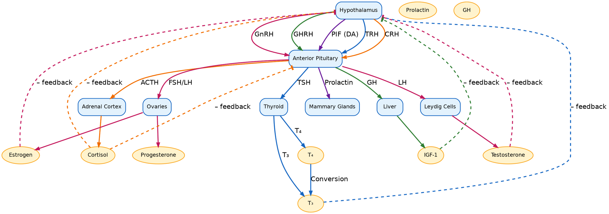

# Overview

- How organs and tissues communicate with each other
- Allows organisms to respond to changes in internal and external stimuli to maintain homeostasis
- Relies on hormonal communication
- Influenced by and influences the [[Nervous System|nervous system]]

# Graph

# Other Stuff

The endocrine system is one way that organs **communicate** with each other. "Endo" means *inside* and "crine" comes from the Greek root "kreinin", which in this case, means "to secrete".

- This system deals with **hormones** which are *secreted* into the **bloodstream**

## General Definitions

- **Gland**: an organ that *secretes* hormones
- **Hormone**: a *chemical* messenger that is secreted into the bloodstream

## [[Hormones]]

Hormones are the *messengers* of the endocrine system. Hormones are classified based on

1. Their makeup

- [[Peptide Hormones]]
- [[Amino Acid-Derived Hormones]]
- [[Steroid Hormones]]

2. Their intended action

- **[[Tropic Hormones]]** act on a *gland* to secrete a hormone
- **[[Direct Hormones]]** act on the *target tissue*

## The big players: hypothalamus and pituitary

Many endocrine axes start at the **[[hypothalamus]]**, which secretes [[Endocrine System/Peptide Hormones|peptide hormones]] that act on the [[anterior pituitary]].

- These are [[tropic hormones]]

The hypothalamus also [[Action Potentials|electrically stimulates]] the [[posterior pituitary]].

## [[Endocrine System/Pituitary Gland|Pituitary Gland]]

The pituitary gland has two lobes: the ***anterior** pituitary* and the ***posterior** pituitary*. How the hypothalamus sends the signal depends on which lobe the axis utilizes.

### [[Endocrine System/Anterior Pituitary|Anterior Pituitary]]

The [[Endocrine System/Anterior Pituitary|anterior pituitary]] (AP) is made of [[Gland|glandular]] tissue that can both synthesize and secrete [[Endocrine System/Peptide Hormones|peptide hormones]]. The hypothalamus releases ***releasing*** and ***inhibiting*** factors into the ***[[Hypophyses|hypophyseal]] [[Portal System|portal system]]***.  

- Hypothalamus sends ==[[Gland#Types of Glands|endocrine]] hormones to anterior pituitary==

#### Axes Involving Anterior Pituitary

##### Tropic Hormones

- [[Endocrine System/Reproductive Axis|HPG Axis]]
  - AP hormones: **[[Follicle Stimulating Hormone (FSH)]]** and **[[Lutenizing Hormone (LH)]]**
  - [[Gonadotropin Releasing Hormone (GnRH)]] --> FSH + LH --> [[Androgens]]
- [[Endocrine System/HPA Axis|HPA Axis]]
  - [[Corticotropin Releasing Factor (Hormone)]] --> [[Adrenocorticotropic Releasing Hormone (ACTH)]] --> [[Glucocorticoids]]
- [[Endocrine System/Thyroid Axis|HPT Axis]]
  - TRH --> TSH --> T3 + T4

##### Direct Hormones

- [[Prolactin]]
  - PIF (Dopamine) --| Prolactin
- [[Endorphins]]
  - CRH --> Endorphins
  - Glucocorticoids --| Endorphins
- [[Growth Hormone]]
  - GHRH --> GH
  - Somatostatin --| GH

| Hypothalamic Hormone | AP Hormone | Target Tissue          | Effect          |
| -------------------- | ---------- | ---------------------- | --------------- |
| GnRH                 | FSH        | Ovaries, Sertoli cells |                 |
|                      | LH         |                        |                 |
| CRF                  | ACTH       | Adrenal cortex         | glucocorticoids |
| TRH                  | TSH        |                        |                 |

### [[Endocrine System/Posterior Pituitary|Posterior Pituitary]]

The [[Endocrine System/Posterior Pituitary|posterior pituitary]] only *stores* hormones that the *hypothalamus produces*. The hypothalamus sends axons down into the posterior pituitary. When depolarized, the posterior pituitary releases the hormones (known as **neurohormones**) from the [[Neuron Structure|axon terminals]].

[[Anti-Diuretic Hormone (ADH)]]
[[Oxytocin]]

## Target Tissues

### [[Adrenal Gland]]

### [[Renal Hormones]]

### [[Pancreatic Hormones]]

[[Endocrine System/Renin-Angiotenisin-Aldosterone System|Renin-Angiotensin-Aldosterone System]]
[[Catecholamines]]

[[Parathyroid Gland]]

Appetite hormones
[[ghrelin]]
[[leptin]]
[[somatostatin]]

[[pineal gland]]
[[thymus]]

[[anp]]

[[Digestion]]
[[Gastrin]]
[[Cholecystekinin]]

whether the axis uses the [[Public/Endocrine System/Anterior Pituitary|anterior pituitary]] or the [[Public/Endocrine System/Posterior Pituitary|posterior pituitary]].
