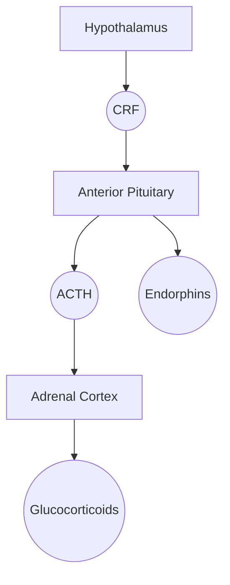

#InProgress 

![[Pasted image 20251120225518.png]]
The HPA Axis is engaged when the 
- Hormones involved: 
	- CRF (Corticotropin Releasing Factor)
	- ACTH (AdrenoCortico[[Public/Endocrine System/Hormones|Tropic]] Hormone)
	- Glucocorticoids
		- Cortisol: in humans
		- Cortisone: in rodents
		- [[Steroid Hormones]]

- What is it:
	- The main stress response system (Dunlavey 2018)
	- Modulates metabolism, immune responses, and [[Nervous System Organization|ANS (autonomic nervous system)]]
	- Basic explanation:
		- [[Endocrine System/Hypothalamus|Hypothalamus]] releases [[Corticotropin Releasing Factor (Hormone)]] in response to stress
		- CRF stimulates **corticotrophs** in the [[Anterior Pituitary]] to release [[Adrenocorticotropic Releasing Hormone (ACTH)]]
		- ACTH stimulates the [[Adrenal Cortex|adrenal cortex]] to release [[Glucocorticoids|glucocorticoids]] (ie cortisol)
		- [[Glucocorticoids]] stimulate the [[Adrenal medulla|adrenal medulla]] to release [[Catecholamines|catecholamines]]

# Stress Physiology - What do GCs do?

- [[Fatty Acid Metabolism|Lipolysis]] and [[Protein metabolism|proteolysis]], vasoconstriction, alter stress-related behaviors, suppress reproduction 
- Deleterious effects: immune function, cardiovascular health, metabolic functions, neural
	- Chronic exposure has effects on multiple conditions, specifically pertaining: neurodegeneration