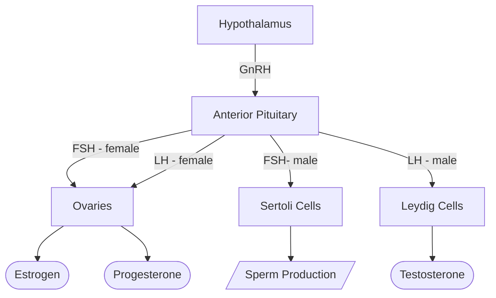

#InProgress 

1. GnRH expressing neurons in the [[Public/Endocrine System/Hypothalamus|Hypothalamus]] releases [[Gonadotropin Releasing Hormone (GnRH)]] into the [[Hypophyses]] [[Portal System|portal system]]
2. The [[Endocrine System/Anterior Pituitary|anterior pituitary]], in response, releases [[Follicle Stimulating Hormone (FSH)]] and [[Lutenizing Hormone (LH)]]

- Talk about anti mullerian hormone and mullerian ducts
- mesonephric ducts

## Reproductive Axis in Females

The ovarian and uterine cycles in females occur concurrently. We'll first talk about each separately and then put it together. 
### Ovarian Cycle

Goals: 
- Get ovum out of the ovary so it can be [[Fertilization|fertilized]]
- Prepare endometrial lining for implantation
	- Essentially ==thicken the endometrium==
	- ***E*strogen** helps *E*stablish the endometrial lining, and **progesterone** maintains it

1. **Follicular Phase**: Hypothalamus releases **GnRH**, so AP releases *small* amounts of **FSH** and **LH**
	- FSH and LH act on the **ovaries** and causes it to release **estrogens**. 
		- Low levels of estrogen ***inhibits*** GnRH production, but high levels ***stimulates*** it
	- Rising estrogen levels cause a *surge* of LH (and FSH to a smaller extent)

GRAPH HERE OF JUST FOLLICULAR PHASE

2. **Ovulation**: The LH surge causes the ovarian follicle to rupture and *release* a [[Oogenesis|secondary oocyte]] into the uterine tube
3. **Luteal Phase**: LH makes the now ruptured follicle becomes what's called the **corpus luteum**
	- Corpus luteum secretes lots of **progesterone** (and some estrogen)
	- The high levels of progesterone *suppress GnRH production*
		- Prevents maturation of multiple follicles
#### If fertilization occurs:
4. Corpus luteum continues to produce progesterone and estrogens
#### If no fertilization - Menstrual Phase

The cycle resets, but in order to do that, the endometrial lining must shed. This is called the **menstrual cycle**.  

1. **Menstrual phase**: uterus sheds endometrial lining
	- Towards the end of this phase is when FSH and LH are released (first step of [[Public/Endocrine System/Reproductive Axis#Ovarian Cycle| ovarian cycle]])
2. **Proliferative phase**: the endometrial lining doubles in thickness and is vascularized to prep for embryo implantation
3. **Secretory phase**: The high levels of progesterone and estrogen thicken and develop the endometrium

[[Sex Hormones]]
[[SRY gene]]